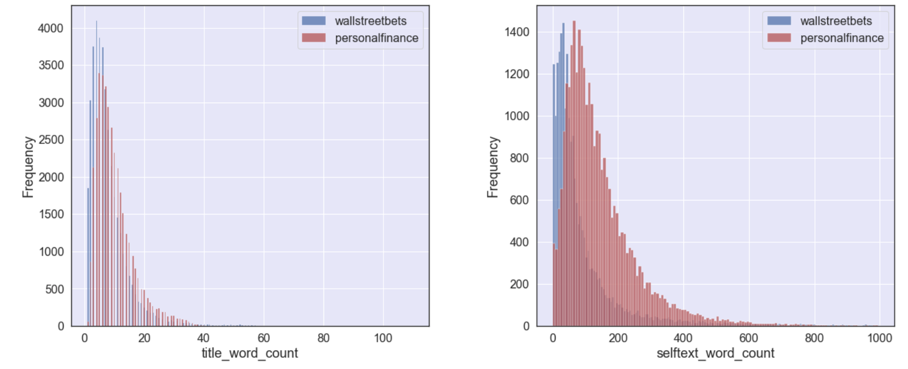
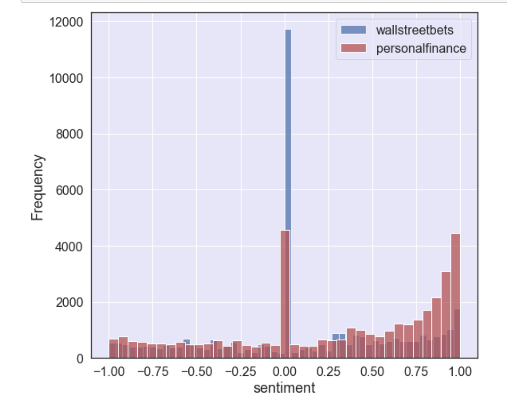
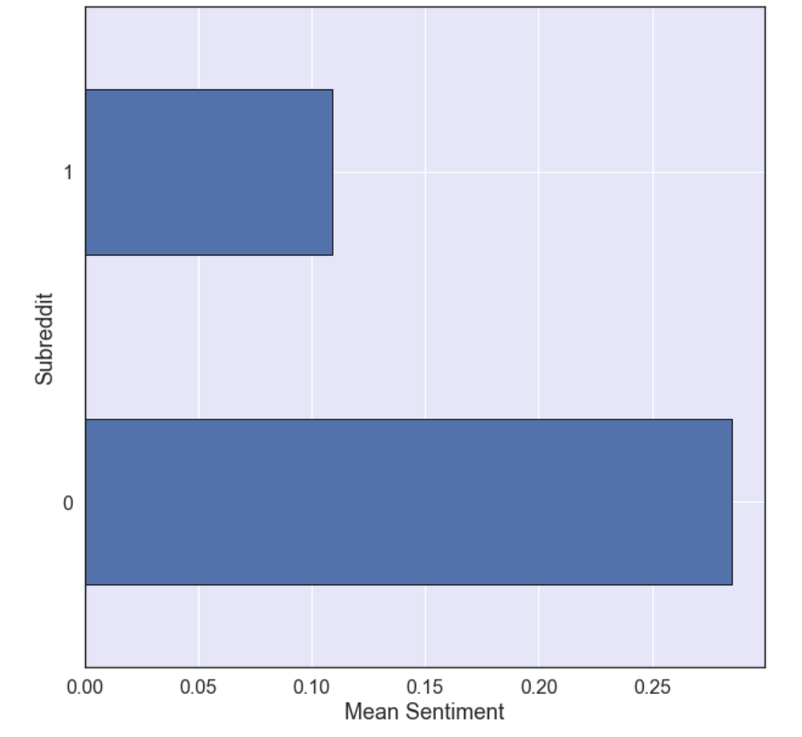
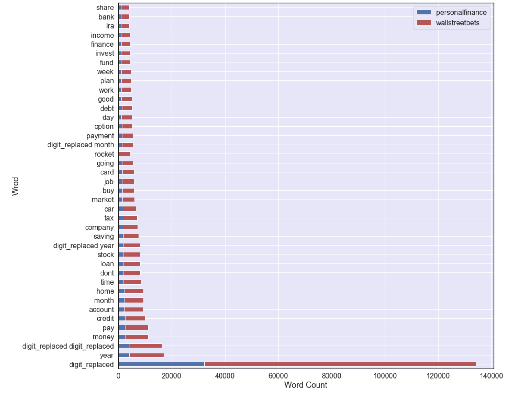
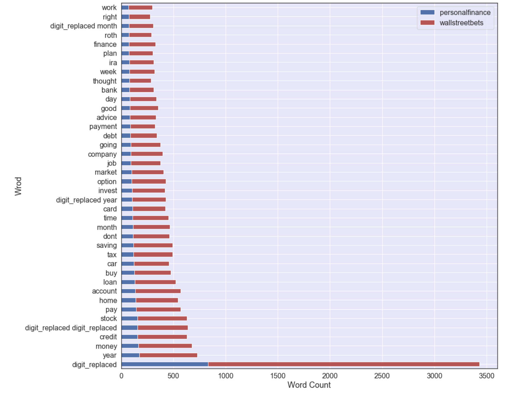
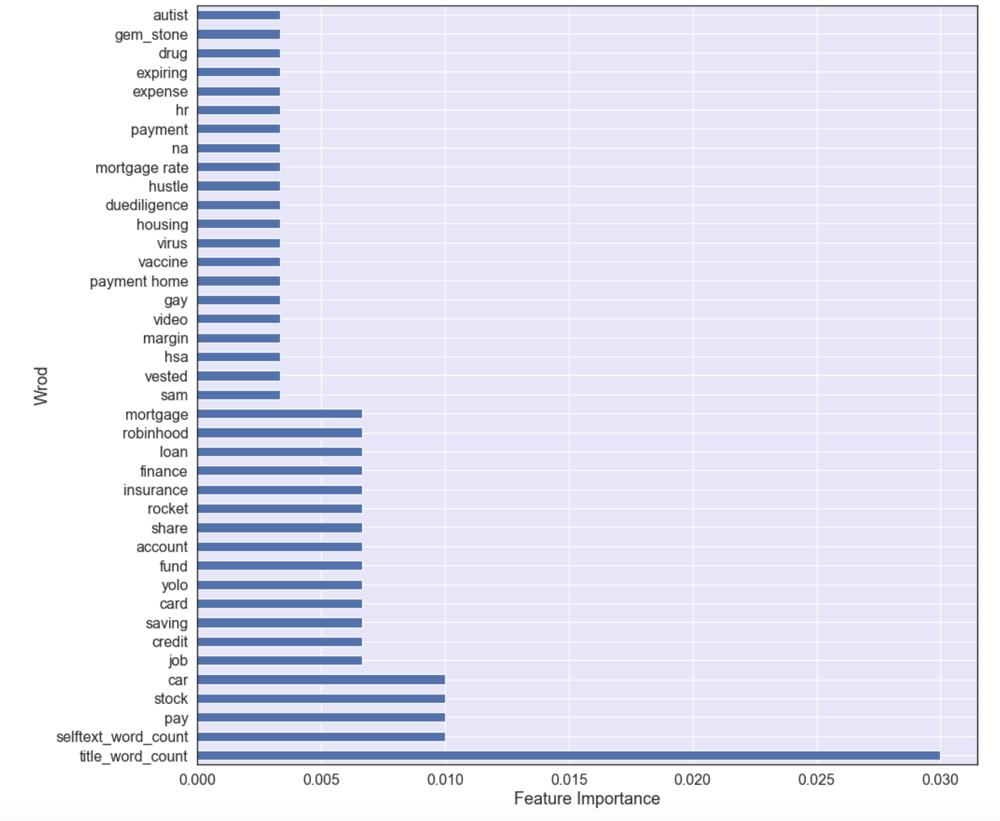
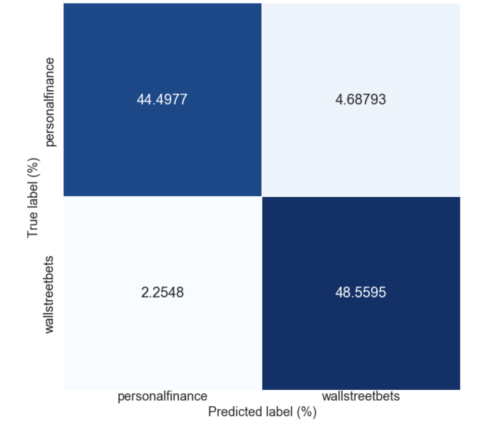

# Using NLP to Understand the Financial Interests of Retail Traders on Reddit

<table><tr>
<td bgcolor="ghostwhite"> 
    <figure>
        

 
    </figure>
</td>    
<td bgcolor="ghostwhite">
    <figure>
        

    </figure> 
</td>
<td bgcolor="ghostwhite">
    <figure>
        

    </figure> 
</td>    
    
    
</tr></table>  

***  
### Problem Statement
 

      
      
In the recent years, social media has become an inseparable part of our daily life. Not only social media platforms have changed our social interactions, but also they have affected our financial behaviors. An example of this impact is the fiasco happened in 2021 around trading of some meme stock like GameStop and AMC on Robinhood platform. A group of retail investors on Reddit decided to challenge the hedge fund managers and institutional investors who short sold these meme stocks. This unprecedented attempt caused GameStop and AMC Short sellers to lose \$673 Million [(source)](https://www.bloomberg.com/news/articles/2021-05-26/gamestop-and-amc-s-wednesday-rally-hand-shorts-673-million-loss). This illustrates that hedge fund managers and institutional investors, from now on, need to pay attention to the behavior of retail investors on social media. 
The current analysis is focused on using NLP to recognize the interest of retail investors on Reddit social media. To achieve this goal, two popular financial subreddit communities were selected for this study, WallStreetBets and PersonalFinance. The analysis uses Machine Learning to classifies the posts to its corresponding subreddit and find which words or phrases help better to differentiate the interests of investors who post on these groups.

***  
### Contents:
- [Background](#Background)
- [Datasets](#Datasets)
- [Preprocessing](#Preprocessing)
- [Modeling](#Modeling)
- [Conclusion](#Conclusion)

***  
### Background
 

    
According to the [SEC](https://www.sec.gov/about/what-we-do), in 2020, "American households own \$29 trillion worth of equities—more than 58\% of the U.S. equity market—either directly or indirectly through mutual funds, retirement accounts, and other investments. According to the [Federal Reserve's](https://www.federalreserve.gov/publications/files/scf20.pdf) survey of consumer finances, about 53\% of families owned stocks, and 70\% of upper-middle-income families owned stocks in 2019. The purpose of all these investments is to help individuals to have financial security and independence in life. One of the ways to achieve that is to become a retail investor.

A retail investor is a non-professional investor who buys and sells securities like stocks, bonds or ETFs. Retail investors purchase securities for their own personal accounts and invest in much smaller amounts than large institutional investors. Because of their small purchasing power, most retail investors may pay higher fees or commissions for their trades, although in recent years many brokers have followed Robinhood platform in eliminating fees for online trades. In last two years, retail investors have gained more power to significantly impact the market. An example is the story of how GameStop and AMC, two popular meme stocks on WallStreetBets subreddit, valuations surged into all-time highs in 2021 during a global pandemic while the companies were bleeding money and had negative balance sheets. These valuations were all illogical to institutional investors. According to [Bloomberg](https://www.bloomberg.com/news/articles/2021-05-26/gamestop-and-amc-s-wednesday-rally-hand-shorts-673-million-loss), "Those gains pushed mark-to-market losses for short-sellers to roughly $8.1 billion for the year". In contrast to [WallStreetBets](https://www.reddit.com/r/wallstreetbets/) subreddit that attracts mostly short-term investors, [PersonalFinance](https://www.reddit.com/r/personalfinance/) subreddit, with 14.8M users, is a community where individuals can discuss on topics related to budgeting, earning, saving, and investing. This contrast helps to better understand the financial interests of individuals with short-term or long-term goals during their journey of achieving financial independence.

***  
###  Datasets
 

Pushshift Reddit API was used to collect more than 75K published posts on r/personalfinance and r/wallstreetbets
from 2019 to 2021. The pushshift.io Reddit API was designed and created by the /r/datasets mod team to help provide enhanced functionality and search capabilities for searching Reddit comments and submissions [Source](https://github.com/pushshift/api). After cleaning the data and removing the rows with null values, the dataset includes 38856 posts from wallstreetbets and 37613 posts from personalfinance, which indicates a balanced dataset

|Feature|Type |Description|
|:---|:---|:---|
|combined|object| A string created from the words in post title and body|
|title_word_count|Integer|Number of words in post title|
|selftext_word_count|Integer|Number of words in post body|
|sentiment|Float| The sentiment score associated to the post|

***  
### Preprocessing

Data cleaning is an important step for any natural language processing project. Since the posts are only a cluster of words, a machine cannot process them unless they get transformed into a matrix of token counts. Before doing any transformation, the unnecessary contents like special characters or punctuations need to be removed if they don't have any valuable contribution to the document or the modeling phase. In this analysis, a function was developed to (1) converts all uppercase characters in a string into lowercase characters, (2) remove some stopwords such as subreddits names inside the document, (3) replace emoji symbols with their associated words, (4) remove any hyperlinks in the document, (4) lemmatize the bag of words into their root forms to reduce the odds of overfitting, and (5) replace numbers with a made-up word, "digit_replaced". The following table and image show the average word counts and their distributions in each subreddit.

|subreddit|title_word_count |selftext_word_count|
|:---|:---|:---|
|personalfinance|10.1| 120.4|
|wallstreetbets|9.3|69.5|

<table><tr>
<td bgcolor="ghostwhite"> 
    <figure>
        

        
<figcaption>Figure 1. Distribution of word counts in title and selftext columns</figcaption>
  
    </figure> 
</td>    
</tr></table>  

 

The next step was to use a sentiment analyzer, VADER Sentiment Analysis, to estimate the positive, negative or neutral sentiment of a document. VADER, short for Valence Aware Dictionary and sEntiment Reasoner, is a tool developed for evaluating the sentiments of posts in social media. VADER uses a dictionary that maps lexical features to emotion intensities known as sentiment scores. The sentiment score of a text can be obtained by summing up the intensity of each word in the text [source](https://towardsdatascience.com/sentimental-analysis-using-vader-a3415fef7664). The following images show the average compound scores and their distributions in each subreddit. These figures suggest that in general posts published on personalfinance subreddit are more positive than the post published on wallstreetbets.

<table><tr>
<td bgcolor="ghostwhite"> 
    <figure>
        

        
<figcaption>Figure 2a. Average compound scores for corpus in each subreddit.</figcaption>
  
    </figure> 
</td>  
<td bgcolor="ghostwhite"> 
    <figure>
        

        
<figcaption>Figure 2b. Distribution of compound scores for corpus in each subreddit.</figcaption>
  
    </figure> 
</td>   
</tr></table>  

 

The last step of preprocessing was to convert a collection of the text documents to a matrix of token counts or a matrix of TF-IDF features using CountVectorizer or TfidfVectorizer in sklearn library. To enhance efficiency, only the words that satisfied the following rules were selected for the classification exercise:

- the top 5000 words ordered by term frequency across the corpus.
- the words that have a document frequency of at least 2.
- the words that that have a document frequency lower than 98\% in corpus/
- words with lower and upper boundary of the range of 2-values.
- words that are not in the stopwords list.

The following figure shows the top 40 words for each subreddit using CountVectorizer or TfidfVectorizer library.

<table><tr>
<td bgcolor="ghostwhite"> 
    <figure>
        

        
<figcaption>Figure 3a. Top 40 words for each subreddit using CountVectorizer.</figcaption>
  
    </figure> 
</td>  
<td bgcolor="ghostwhite"> 
    <figure>
        

        
<figcaption>Figure 3b. Top 40 words for each subreddit using TfidfVectorizer.</figcaption>
  
    </figure> 
</td>   
</tr></table>  

 

***  
### Modeling

Different machine learning models in this analysis were examined to find the best classifier with the lowest overfitting. The results are presented in the following table. All the models perform substantially better than the baseline 0.508 and 0.492 for wallstreetbets and personalfinance. The reported scores for train and test sets indicate that a combination of AdaBoost model and CountVectorizer gives a classifier with the least overfitting.

|Model|Vectorizer|Train F1 Score|Test F1 Score|
|:---|:---|:---:|:---:|
|Logistic Regression|CountVectorizer|0.976|0.935|
|Logistic Regression|TFIDFVectorizer|0.968|0.946|
|Random Forest|CountVectorizer|0.996|0.939|
|Random Forest|TFIDFVectorizer|0.997|0.938|
|AdaBoost|CountVectorizer|0.939|0.933|
|AdaBoost|TFIDFVectorizer|0.945|0.937|

Figure 4a suggests shows the top 40 features with most impact in classifying posts from each subreddit using a combination of AdaBoost model and CountVectorizer. Figure 4b reports the confusion matrix of this case. By looking at the Figure 4a and knowing briefly the history of each subreddit community, one may conclude that the words associated with wallstreetbets subreddit mostly include rocket emoji, gem_stone emoji, or options expiration. The lengths of the posts title and body text are also major differentiators between two subreddits. This interesting selection of differentiators may indicate that individuals with short-interest investment are more attracted to submit posts on wallstreetbets. However, individuals posting on PersonalFinance are more looking for information to help them paying off their home mortgage, car loan, budgeting, or refinancing their assets.

<table><tr>
<td bgcolor="ghostwhite"> 
    <figure>
        

        
<figcaption>Figure 4a. Top40 features with most impact in classifying posts using a combination of AdaBoost model and CountVectorizer.</figcaption>
  
    </figure> 
</td>  
<td bgcolor="ghostwhite"> 
    <figure>
        

        
<figcaption>Figure 4b. Confusion matrix where a combination of AdaBoost model and CountVectorizer is used.</figcaption>
  
    </figure> 
</td>   
</tr></table>  

***  
### Conclusion

In conclusion, retail investors are slowly become an important player in the financial market and understanding their interests or dislikes may help regulators, institutional investors and online trading platforms to be less surprised next time that a group of retail investors shake the financial market.

